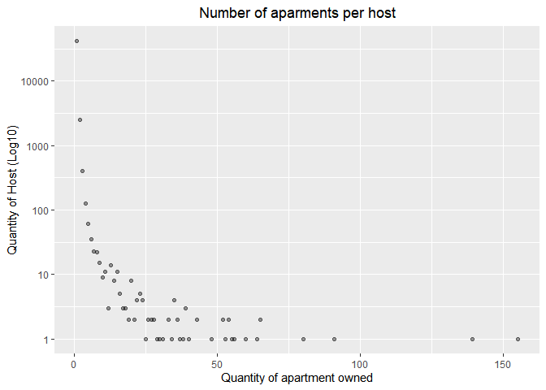
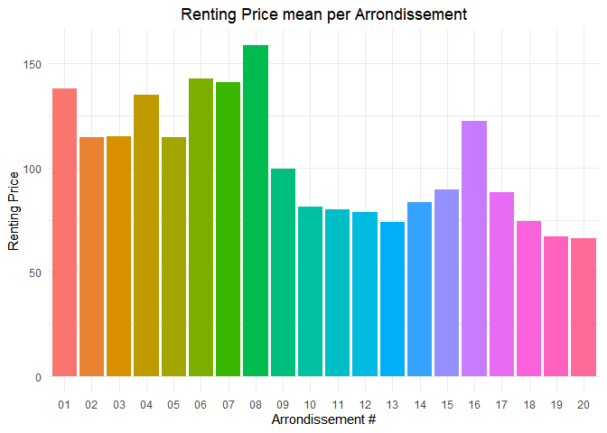
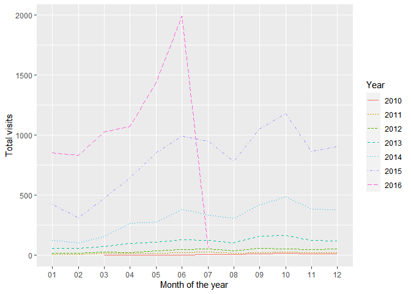
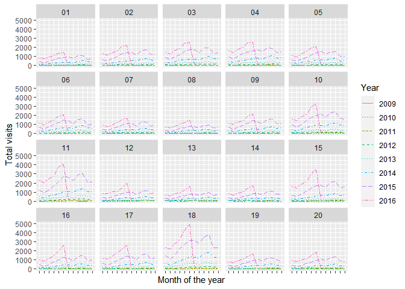
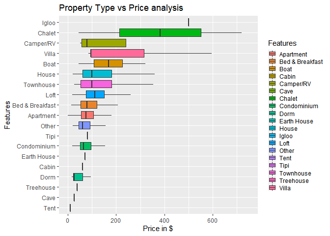
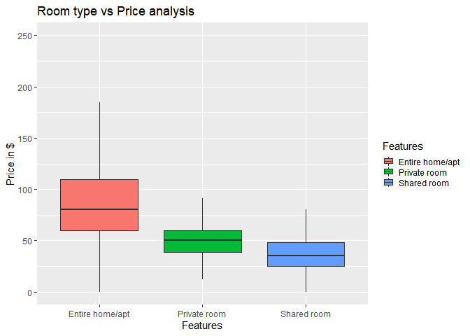
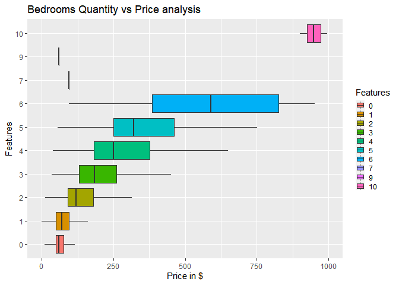

R4BD Project
================
Nelson López

## Libraries import

For this analysis we will use the following libraries:

``` r
library("shiny")
library("dplyr")
library("ggplot2")
library("lubridate")
```

## Initial analysis Requirements by the professor

Relationship between prices and apartment features Number of apartments
per owner Renting price per city quarter (“arrondissements”) Visit
frequency of the different quarters according to time

## Approach

1- The first look at the data:

-   what information do we have?
-   what information is missing?
-   discover general facts: time period, total number of listings in the
    dataset

2- Initial data preparation:

-   remove irrelevant information;
-   reformat the information and imputing missing values;

3- High level analysis:

-   Find out answers to the questions above
-   Fin out general analysis about the data found

## First Look at the data, What information do we have?

Data provided, consists of 2 tables:

-   L Table: Summary information on listing in Paris with general
    information such as: host information, location, zip code, price,
    etc.
-   R Table: List of listing reservations completed with date

``` r
colnames(L)
```

    ##  [1] "id"                               "listing_url"                     
    ##  [3] "scrape_id"                        "last_scraped"                    
    ##  [5] "name"                             "summary"                         
    ##  [7] "space"                            "description"                     
    ##  [9] "experiences_offered"              "neighborhood_overview"           
    ## [11] "notes"                            "transit"                         
    ## [13] "access"                           "interaction"                     
    ## [15] "house_rules"                      "thumbnail_url"                   
    ## [17] "medium_url"                       "picture_url"                     
    ## [19] "xl_picture_url"                   "host_id"                         
    ## [21] "host_url"                         "host_name"                       
    ## [23] "host_since"                       "host_location"                   
    ## [25] "host_about"                       "host_response_time"              
    ## [27] "host_response_rate"               "host_acceptance_rate"            
    ## [29] "host_is_superhost"                "host_thumbnail_url"              
    ## [31] "host_picture_url"                 "host_neighbourhood"              
    ## [33] "host_listings_count"              "host_total_listings_count"       
    ## [35] "host_verifications"               "host_has_profile_pic"            
    ## [37] "host_identity_verified"           "street"                          
    ## [39] "neighbourhood"                    "neighbourhood_cleansed"          
    ## [41] "neighbourhood_group_cleansed"     "city"                            
    ## [43] "state"                            "zipcode"                         
    ## [45] "market"                           "smart_location"                  
    ## [47] "country_code"                     "country"                         
    ## [49] "latitude"                         "longitude"                       
    ## [51] "is_location_exact"                "property_type"                   
    ## [53] "room_type"                        "accommodates"                    
    ## [55] "bathrooms"                        "bedrooms"                        
    ## [57] "beds"                             "bed_type"                        
    ## [59] "amenities"                        "square_feet"                     
    ## [61] "price"                            "weekly_price"                    
    ## [63] "monthly_price"                    "security_deposit"                
    ## [65] "cleaning_fee"                     "guests_included"                 
    ## [67] "extra_people"                     "minimum_nights"                  
    ## [69] "maximum_nights"                   "calendar_updated"                
    ## [71] "has_availability"                 "availability_30"                 
    ## [73] "availability_60"                  "availability_90"                 
    ## [75] "availability_365"                 "calendar_last_scraped"           
    ## [77] "number_of_reviews"                "first_review"                    
    ## [79] "last_review"                      "review_scores_rating"            
    ## [81] "review_scores_accuracy"           "review_scores_cleanliness"       
    ## [83] "review_scores_checkin"            "review_scores_communication"     
    ## [85] "review_scores_location"           "review_scores_value"             
    ## [87] "requires_license"                 "license"                         
    ## [89] "jurisdiction_names"               "instant_bookable"                
    ## [91] "cancellation_policy"              "require_guest_profile_picture"   
    ## [93] "require_guest_phone_verification" "calculated_host_listings_count"  
    ## [95] "reviews_per_month"

``` r
colnames(R)
```

    ## [1] "listing_id" "date"

## Removing irrelevant information for our analysis

For our analysis we will use few columns and will drop other columns in
the cleaning data process: id, host\_name, property\_type, bathrooms,
bed\_type, price, calculated\_host\_listings\_count, listing\_url,
host\_id, host\_is\_superhost, zip code, country\_code, longitude,
room\_type, bedrooms, weekly\_price, neighbourhood, city, beds,
monthly\_price, latitude, minimum\_nights.

## Data Handling and cleaning for answer questions

Importing dplyr library for data manipulation and ggplot to
visualizations. Building a new table with our working data

``` r
listing_df <- select(L, id, host_name, property_type, bathrooms, bed_type, price, calculated_host_listings_count, listing_url, host_id, host_is_superhost, zipcode, country_code, longitude, room_type, bedrooms, weekly_price, neighbourhood, city, beds, monthly_price, latitude, minimum_nights)
```

Checking NA values and if we need to impute them

``` r
table(is.na(listing_df))
```

    ## 
    ##   FALSE    TRUE 
    ## 1159434     516

Checking NA values per column

``` r
colSums(is.na(listing_df))
```

    ##                             id                      host_name 
    ##                              0                              0 
    ##                  property_type                      bathrooms 
    ##                              0                            243 
    ##                       bed_type                          price 
    ##                              0                              0 
    ## calculated_host_listings_count                    listing_url 
    ##                              0                              0 
    ##                        host_id              host_is_superhost 
    ##                              0                              0 
    ##                        zipcode                   country_code 
    ##                              0                              0 
    ##                      longitude                      room_type 
    ##                              0                              0 
    ##                       bedrooms                   weekly_price 
    ##                            193                              0 
    ##                  neighbourhood                           city 
    ##                              0                              0 
    ##                           beds                  monthly_price 
    ##                             80                              0 
    ##                       latitude                 minimum_nights 
    ##                              0                              0

We suppress all reviews columns and square feet too because there were
50000 missing values of 52725 obs, this means that we cannot handle this
quantity of missing values because they are too many according to the
total data. About bedrooms, beds, and bathrooms missing data, we will
impute them replacing NA values by the mean because they represents a
small percentage of the total data

``` r
for (j in 1:ncol(listing_df)){
  sel = is.na(listing_df[,j])
  listing_df[sel,j] = mean(listing_df[,j],na.rm=TRUE) 
}
```

Checking data types

``` r
str(listing_df)
```

    ## 'data.frame':    52725 obs. of  22 variables:
    ##  $ id                            : int  4867396 7704653 2725029 9337509 12928158 5589471 2728649 793550 9337880 9433064 ...
    ##  $ host_name                     : Factor w/ 9344 levels "","(EMAIL HIDDEN)",..: 5994 1786 8875 4407 2043 7182 1365 965 536 3061 ...
    ##  $ property_type                 : Factor w/ 20 levels "","Apartment",..: 2 2 2 2 2 12 2 2 2 2 ...
    ##  $ bathrooms                     : num  1 2 1 1 1 3 1 1 1 1.5 ...
    ##  $ bed_type                      : Factor w/ 5 levels "Airbed","Couch",..: 5 5 5 5 5 5 5 5 5 5 ...
    ##  $ price                         : Factor w/ 498 levels "$0.00","$1,001.00",..: 405 128 457 405 362 114 20 214 496 304 ...
    ##  $ calculated_host_listings_count: int  1 1 1 1 1 1 1 1 1 2 ...
    ##  $ listing_url                   : Factor w/ 52725 levels "https://www.airbnb.com/rooms/10001536",..: 30010 43978 21779 49986 10074 32753 21793 44842 49990 50439 ...
    ##  $ host_id                       : int  9703910 35777602 13945253 5107123 51195601 28980052 13964280 4180763 15784875 8307327 ...
    ##  $ host_is_superhost             : Factor w/ 3 levels "","f","t": 2 2 2 2 2 2 2 2 2 2 ...
    ##  $ zipcode                       : Factor w/ 79 levels ""," ","13006",..: 31 31 31 31 31 31 31 31 31 31 ...
    ##  $ country_code                  : Factor w/ 2 levels "CH","FR": 2 2 2 2 2 2 2 2 2 2 ...
    ##  $ longitude                     : num  2.32 2.29 2.32 2.32 2.3 ...
    ##  $ room_type                     : Factor w/ 3 levels "Entire home/apt",..: 1 1 1 1 2 1 1 1 1 1 ...
    ##  $ bedrooms                      : num  1 2 1 1 1 4 2 2 1 1 ...
    ##  $ weekly_price                  : Factor w/ 1186 levels "","$1,001.00",..: 695 1 814 1 1 1 902 341 1 1 ...
    ##  $ neighbourhood                 : Factor w/ 64 levels "","Alésia","Austerlitz",..: 6 12 6 6 52 6 6 6 52 52 ...
    ##  $ city                          : Factor w/ 136 levels ""," Deuil-la-Barre ",..: 54 54 54 54 54 54 54 54 54 54 ...
    ##  $ beds                          : num  1 3 1 1 1 4 2 2 1 1 ...
    ##  $ monthly_price                 : Factor w/ 1473 levels "","$1,000.00",..: 1 1 213 1 1 1 1 1 1 1 ...
    ##  $ latitude                      : num  48.9 48.9 48.9 48.9 48.9 ...
    ##  $ minimum_nights                : int  1 1 3 2 1 3 1 3 1 1 ...

Checking zipcode content, after analyse neighbourhood content, i decided
to generate location of the listings by zip code.

``` r
summary(listing_df$zipcode)
```

    ##                                  13006        17200       700014         7009 
    ##          504            1            1            1            1            1 
    ##        74000           75       75 018        75000        75001       750016 
    ##            1            5            1            1         1101            1 
    ##        75002        75003        75004        75005        75006        75007 
    ##         1565         1942         1800         1990         1825         1525 
    ##        75008        75009        75010       750109        75011  75011 PARIS 
    ##         1411         2318         3511            1         4825            1 
    ##        75012        75013        75014 75014\n75014        75015        75016 
    ##         2082         1858         2093            1         3799         1566 
    ##        75017        75018        75019 75019\n75019        75020        75106 
    ##         3465         5973         2652            1         2859            1 
    ##        75116         7517        75522        78008        79019        91330 
    ##         1336            1            1            1            1            1 
    ##        92100        92110        92120        92130        92150        92170 
    ##           66           37           23           52            7           14 
    ##        92200        92210        92240        92300        92800        93100 
    ##           75            7            8           52            1            4 
    ##        93170        93210        93260        93300        93310        93320 
    ##           25            1           14           17           25            1 
    ##        93400        93500        94120        94130        94160        94200 
    ##           27           24            8            5           24           21 
    ##        94220        94230        94250        94270        94300        94340 
    ##           23            1           25           29           60            2 
    ##        94410        95000        95170          adf   Montmartre        Paris 
    ##           13            1            4            1            1            2 
    ##  Paris 75004 
    ##            1

## Number of apartments per owner answer

Creating new df to answer “Number of apartments per owner” question, and
plotting a sample of 100 observations

``` r
listing_df$host_id <- factor(listing_df$host_id)
```

``` r
host_apartment_count <- listing_df %>%  group_by(listing_df$host_id) %>% count(listing_df$host_id)
host_apartment_count$n <- factor(host_apartment_count$n)
host_apartment_count <- host_apartment_count[order(host_apartment_count$n, decreasing = TRUE),]
host_df_toplot <- head(host_apartment_count,100)
host_df_toplot$n <- as.numeric(levels(host_df_toplot$n))[host_df_toplot$n]
host_df_toplot
```

    ## # A tibble: 100 x 2
    ## # Groups:   listing_df$host_id [100]
    ##    `listing_df$host_id`     n
    ##    <fct>                <dbl>
    ##  1 2288803                155
    ##  2 2667370                139
    ##  3 12984381                91
    ##  4 3972699                 80
    ##  5 3943828                 65
    ##  6 21630783                65
    ##  7 39922748                64
    ##  8 789620                  60
    ##  9 11593703                56
    ## 10 3971743                 55
    ## # ... with 90 more rows

``` r
df_host_to_plot <- host_apartment_count %>%  group_by(host_apartment_count$n) %>% count(host_apartment_count$n )
df_host_to_plot$n <- as.factor(df_host_to_plot$n)
df_host_to_plot$n <- as.numeric(levels(df_host_to_plot$n))[df_host_to_plot$n]
df_host_to_plot$`host_apartment_count$n` <- as.numeric(levels(df_host_to_plot$`host_apartment_count$n`))[df_host_to_plot$`host_apartment_count$n`]
df_host_to_plot
```

    ## # A tibble: 53 x 2
    ## # Groups:   host_apartment_count$n [53]
    ##    `host_apartment_count$n`     n
    ##                       <dbl> <dbl>
    ##  1                        1 41562
    ##  2                        2  2492
    ##  3                        3   404
    ##  4                        4   125
    ##  5                        5    61
    ##  6                        6    35
    ##  7                        7    23
    ##  8                        8    22
    ##  9                        9    15
    ## 10                       10     9
    ## # ... with 43 more rows

Plotting all observations, we can see that around 41000 host has only 1
accomodation listed, after that we can see some outliers like the host
that has more accomodations (155)

``` r
ggplot(df_host_to_plot, aes(x=`host_apartment_count$n`, y=n) ) +
geom_point(alpha = 2/5) + labs(title= "Number of aparments per host", y="Quantity of Host (Log10)", x = "Quantity of apartment owned", fill = "Legend - Host") + theme(plot.title = element_text(hjust = 0.5), plot.subtitle = element_text(hjust = 0.5), legend.position = "none") + scale_y_continuous(trans = "log10") 
```

<!-- -->

### Conclusion 1

After doing some research we see on the plots that, the majority of host
has only 1 acommodation published (around 41k hosts), we have some max
“top 10” that have more than 60 acommodations. on the Internet we found
some people or agencies that work with different properties and manage
only the Airbnb acommodation.

## Renting Price per Arrondissemment

Creating a new df to answer “Renting price per city quarter
(“arrondissements”)" question, what are we doing is that we are
selecting id, zip code and price and filter by zip code to define
arrondissements, In this process I am dropping around 1229 observations
that represent around 0.02% of the data and don’t add value to our data
because those values are not well structured by zip code and to use we
have to fix one by one, this decision is taken because we don’t want to
manipulate few registers in a big data analysis, I decided to drop these
observations

``` r
arrondissement_price_table <- listing_df %>%
  select(c('id', 'host_id','zipcode','price'))%>%
  filter(zipcode %in% c(seq(75001,75020,1),75116))%>%
  mutate(arrondissement=substring(zipcode,5-1,5),price_formatted=(as.numeric(gsub("\\$", "",price))))
```

Imputing NA values in our “price\_formatted” column for the mean price

``` r
colSums(is.na(arrondissement_price_table))
```

    ##              id         host_id         zipcode           price  arrondissement 
    ##               0               0               0               0               0 
    ## price_formatted 
    ##              49

``` r
for (j in 1:ncol(arrondissement_price_table)){
  sel = is.na(arrondissement_price_table[,j])
  arrondissement_price_table[sel,j] = mean(arrondissement_price_table[,j],na.rm=TRUE) 
}
```

Checking data types of arrondissement\_price table and computing mean
price by arrondissement

``` r
str(arrondissement_price_table)
```

    ## 'data.frame':    51496 obs. of  6 variables:
    ##  $ id             : int  4867396 7704653 2725029 9337509 12928158 5589471 2728649 793550 9337880 9433064 ...
    ##  $ host_id        : Factor w/ 44874 levels "2626","2883",..: 15314 33740 19379 8221 39640 30082 19414 6724 21183 13657 ...
    ##  $ zipcode        : Factor w/ 79 levels ""," ","13006",..: 31 31 31 31 31 31 31 31 31 31 ...
    ##  $ price          : Factor w/ 498 levels "$0.00","$1,001.00",..: 405 128 457 405 362 114 20 214 496 304 ...
    ##  $ arrondissement : chr  "17" "17" "17" "17" ...
    ##  $ price_formatted: num  60 200 80 60 50 191 100 290 99 401 ...

``` r
mean_renting_price <- group_by(arrondissement_price_table, arrondissement) %>% summarize(Renting_Price = mean(price_formatted))
```

Plotting Renting price per arrondissement

``` r
mp_arr_plot <- ggplot(mean_renting_price, aes(x=arrondissement, y=Renting_Price, fill=arrondissement) ) +
geom_bar (stat="identity")+theme_minimal() + labs(title= "Renting Price mean per Arrondissement", y="Renting Price", x = "Arrondissement #", fill = "Arrondissement #") + theme(plot.title = element_text(hjust = 0.5), plot.subtitle = element_text(hjust = 0.5), legend.key.size = unit(0.4, 'cm'), legend.position = "none")
mp_arr_plot
```

<!-- -->

### Conclusion 2

As a foreigner, I am surprised that the mean renting price of some
arrondissements are more than 100$, the neighbourhood might have a great
influence on the listing price as well as its distance to historical
monuments.

## Visit frequency of the different quarters according to time answer

“Lubridate” package is to handle date format and subtract year and month
from the data, inner join of two tables by listing ID, this way we are
getting all listing visits with all info of the L df in this case i
utilized arrondissement\_price\_table that is a cleaned and filtered
data.

``` r
visit_feq_df <- inner_join(R,arrondissement_price_table,by=c('listing_id'='id'))
visit_feq_df$date <- ymd (visit_feq_df$date)
visit_feq_df$Year <- format(as.Date(visit_feq_df$date), "%Y")
visit_feq_df$month <- format(as.Date(visit_feq_df$date), "%m")
```

Group by month year and arrondissement with dplyr and summarize them
with respect to number of times by month appears each listing id.

``` r
Visit_feq_df_grouped <- visit_feq_df %>% group_by(Year,month,arrondissement) %>% summarize(nummonth=n())
visit_df_to_plot <- Visit_feq_df_grouped %>% filter(arrondissement %in% "12")
```

Plotting visits of Arrondissement 12 vs all years

``` r
ggplot(visit_df_to_plot, aes(x = month, y = nummonth, group = Year, color = Year, linetype = Year)) +
geom_line()+ xlab("Month of the year") + ylab("Total visits")
```

<!-- -->

Plotting visits of all Arrondissements vs all Years

``` r
ggplot(Visit_feq_df_grouped, aes(x = month, y = nummonth, group = Year, color = Year, linetype = Year)) +
geom_line()+ xlab("Month of the year") + ylab("Total visits") + theme(plot.title = element_text(hjust = 0.5), plot.subtitle = element_text(hjust = 0.5), axis.text.x=element_blank()) +
facet_wrap(~ arrondissement)
```

<!-- -->

### Conclusion 3

We can see this in two parts, the first part is about years, we can see
easily that there is an increment on complete reservations starting from
2014, it may be because AirBNB started to consolidate its APP as the
best “Rent App” and people started to use it as a primary rent app, and
the second part is about months, we can see that in all years and all
arrondissements there is an increment on complete reservations in June -
July and Augusts, correspond to summer in Paris.

About the arrondissement, we can see that one of the cheapest
arrondissements (arrondissement 18) (insight found in the previous
analysis) is the most visited one so far, with a considerable number of
visits each year.

## Relationship between prices and apartment features

I selected “Property type”, “room Type” and “bedrooms” to do the feature
vs price analysis, selecting columns to work, computing NA values.

``` r
pricefeature_df <- select(L, id, property_type, bathrooms, bed_type, price, host_is_superhost, room_type, bedrooms, weekly_price, neighbourhood, city, beds, monthly_price, latitude, minimum_nights)
pricefeature_df$priceformatted <- as.numeric(gsub("\\$", "",pricefeature_df$price))
```

Imputing NA values

``` r
for (j in 1:ncol(pricefeature_df)){
  sel = is.na(pricefeature_df[,j])
  pricefeature_df[sel,j] = mean(pricefeature_df[,j],na.rm=TRUE) 
}
```

Converting float values of bedroooms to int

``` r
pricefeature_df$bedrooms <- as.integer(pricefeature_df$bedrooms)
table(pricefeature_df$bedrooms)
```

    ## 
    ##     0     1     2     3     4     5     6     7     9    10 
    ## 10516 31945  7629  2069   460    84    17     2     1     2

Relation between Property type vs Price

``` r
pricefeature_df <- pricefeature_df %>% mutate(property_type = replace(property_type, property_type == "", "Other"))
ggplot(pricefeature_df, aes(x=reorder(property_type, priceformatted), y=priceformatted, fill=property_type) ) +
geom_boxplot(outlier.shape = NA) + coord_flip() + theme(legend.key.size = unit(0.4, 'cm')) +labs(title= "Property Type vs Price analysis", y="Price in $", x = "Features", fill = "Features") + scale_y_continuous(limits = c(0,750))
```

<!-- -->

Relation between Room type vs Price

``` r
ggplot(pricefeature_df, aes(x=reorder(room_type, -priceformatted), y=priceformatted, fill=room_type) ) +
geom_boxplot(outlier.shape = NA) + theme(legend.key.size = unit(0.4, 'cm')) + labs(title= "Room type vs Price analysis", y="Price in $", x = "Features", fill = "Features") + scale_y_continuous(limits = c(0,250))
```

<!-- -->

Convertir bedrooms column to factor to plot.

``` r
pricefeature_df$bedrooms <- as.factor(pricefeature_df$bedrooms)
```

Relation between Bedrooms quantity vs Price

``` r
ggplot(pricefeature_df, aes(x=bedrooms, y=priceformatted, fill=bedrooms) ) +
geom_boxplot(outlier.shape = NA) + coord_flip() + theme(legend.key.size = unit(0.4, 'cm')) + labs(title= "Bedrooms Quantity vs Price analysis", y="Price in $", x = "Features", fill = "Features") + scale_y_continuous(limits = c(0,1000))
```

<!-- -->

### Conclusion 4

I selected “Property type”, “room Type” and “bedrooms” to do a cross
analysis between prices. We can see that a shared room is always cheaper
than an entire house or apartment. About property type, there is a
considerable difference between few types like “Chalet, Villa” that are
the most expensive types and the cheapest ones are “Tent”, “Cave” and
“Dorm”, speaking about bedrooms quantity we see a clearly relation
between while the accommodation have more bedrooms they are more
expensive excepting two situations (7,9).
